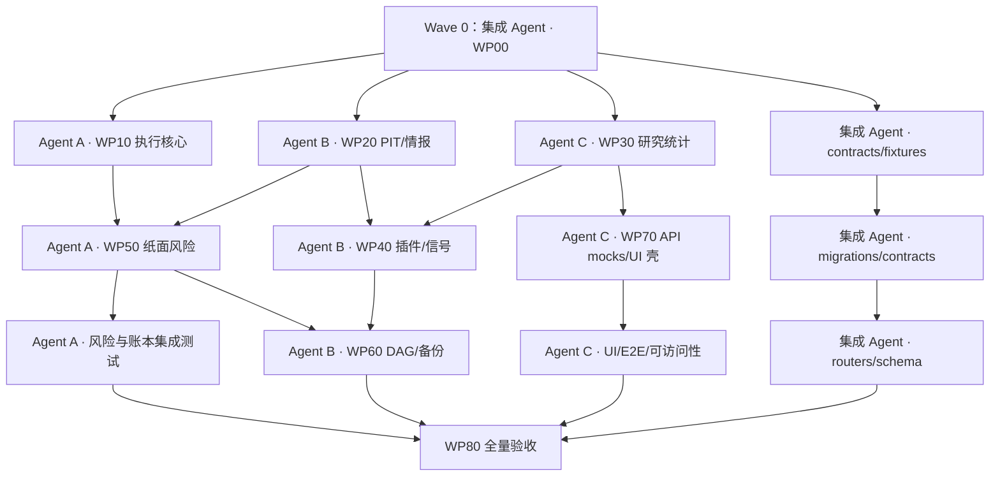

# v2.0 多 Agent 执行与交接手册

| 字段 | 内容 |
|---|---|
| 文档 ID | `PERSONAL-INSTITUTIONAL-CONSOLE-V2-AGENT-RUNBOOK` |
| 状态 | 待执行 |
| 适用仓库 | `E:\\CODEX\\Stock_selection\\accumulation_breakout` |
| 最终审计者 | 与实现 Agent 独立的审计 Agent |

## 1. 使用顺序

每个 Agent 必须按以下顺序阅读：

1. 根 `AGENTS.md`；
2. `tasks/backlog.yaml` 与 `tasks/implementation_state.yaml`；
3. [v2 设计规格](../specs/2026-08-16-institutional-console-v2-design.md)；
4. [数据/PIT合同](../specs/2026-08-16-institutional-console-v2-data-contract.md)、[六形态策略目录](../specs/2026-08-16-institutional-console-v2-strategy-catalog.md)、[平台契约](../specs/2026-08-16-institutional-console-v2-platform-contracts.md)；
5. [v2 实施计划](2026-08-16-institutional-console-v2-implementation.md)；
6. [v2 验收矩阵](2026-08-16-institutional-console-v2-acceptance.md)；
7. 本手册；
8. 自己领取任务引用的现有代码、测试和文档。

未满足依赖或任务不是 `ready` 时不得开始。唯一例外是用户已批准的 `V2-P0-BOOTSTRAP`：集成 Agent 只提交本 v2 文档包和 v2 task DAG，不改业务代码。不要从计划文本自行推断“顺手做一下”的范围。

### 1.1 Planning commit 与 clean worktree

当前 v2 文档为未跟踪文件，且主工作区另有用户文档修改。派发实现 Agent 前，集成 Agent 必须：

1. 显式 `git add` 本 v2 文档、`tasks/backlog.yaml`、`tasks/implementation_state.yaml`，不得 `git add .`；
2. 创建单独 planning commit，确认用户的 `docs/RESEARCH-ROADMAP.md`、`docs/STATUS.md` 仍未被纳入；
3. 从 planning commit 为每个 WP 创建独立 `codex/v2-wpXX-*` 分支/worktree；
4. Agent 只在自己的 worktree 修改，交付 commit SHA；集成 Agent按依赖顺序 cherry-pick；
5. 合并前执行 `git diff --check`、相关测试和 shared-hotspot 检查。

示例（目标目录必须先由集成 Agent解析并确认）：

```powershell
git status --short
git add docs/superpowers/specs/2026-08-16-institutional-console-v2-*.md
git add docs/superpowers/plans/2026-08-16-institutional-console-v2-*.md
git add tasks/backlog.yaml tasks/implementation_state.yaml
git commit -m "docs: freeze personal institutional console v2 plan"
git worktree add ..\ab-v2-wp10 -b codex/v2-wp10 HEAD
```

权威 Python 环境为仓库内 `.venv312`，由 `C:\Users\13818\AppData\Local\Programs\Python\Python312\python.exe` 创建；裸 `python` 当前可能指向 3.14，不得用于发布证据。

## 2. v1.1 → v2.0 迁移口径

### 2.1 保留

- 模块化单体、SQLite、本地单用户。
- `LIVE_TRADING_ENABLED=false` 和研究/交易两区隔离。
- 已有 `scan_jobs`、`research_runs`、daily manifest、release evidence。
- 纸面账户、订单、成交、现金、持仓批次、T+1、日结、对账和幂等骨架。
- `app_factory.py`、`scan_router.py` 拆分骨架。
- Lab、Backtest、引导模式、服务端任务恢复。
- ENTRY V1 作为冻结兼容版本，但必须先纠正同 ID 语义漂移。

### 2.2 替换

| v1.1 口径 | v2.0 唯一口径 |
|---|---|
| “机构覆盖约85%” | 七闸门逐项 PASS/FAIL/INSUFFICIENT |
| `config.py SHA + git sha` | resolved config + code/dirty + dependencies + data/PIT universe + DB + artifact hashes |
| `(code, breakout_date)` UPSERT 状态 | immutable signal observation + events + derived lifecycle projection |
| confirm 即 ENTERED | 只有实际 fill 才 ENTERED |
| GET 触发告警 | 事件/DAG 产生告警，GET 只读 |
| 内存线程是调度事实源 | 持久 DAG、lease、attempt、retry、catch-up |
| equity curve 推导所有收益 | TWR 用估值；MWR 需要完整外部现金流，否则证据不足 |
| 普通可修改 audit_log | append-only、before/after、correlation 和 hash chain |
| 七个本机文件即备份 | online backup、SHA、异位置副本、恢复演练与 RPO/RTO |
| 浏览器手工看起来可用 | API contract、E2E、键盘、窄屏、错误态和恢复测试 |

### 2.3 删除

- “测试不全绿但数量没下降也可通过”。
- “滚动胜率就是 IC/IR”。
- A/B 分支整体线性单调要求。
- 重扫覆盖已成交/已退出信号状态。
- JSON 和数据库两套风险配置事实源。
- GET 创建告警、状态或业务审计记录。
- `/compare` 既必做又可延后的冲突；v2 中属于 P7 明确任务。
- 只比较备份文件或表行数即宣称恢复成功。
- 以代码行数作为模块解耦验收。

### 2.4 新增

- 全量 PIT 修订链、as-of universe、公司行为和数据质量隔离。
- 市场情报中心和六形态策略插件。
- 实验 registry、trial ledger、Nested WF、PBO、DSR、MinTRL、成本与容量。
- 不可变信号观察、outcomes、生命周期和统一审计。
- 组合暴露、VaR/CVaR、压力情景和唯一约束引擎。
- 持久每日 DAG、备份恢复、健康和证据总索引。

## 3. Work Packages

### WP00：契约、基线与 schema 编号

- Owner：根/集成 Agent，必须串行最先完成。
- 对应：P0。
- 输出：readiness schema、错误码、OpenAPI 草案、领域事件、迁移版本 registry、基线 manifest、fixtures。
- 共享文件：`tasks/backlog.yaml`、`tasks/implementation_state.yaml`、`pyproject.toml`、`.github/workflows/ci.yml`、`ab_screener/data/migration_registry.py`、`docs/ADR/ADR-021-v2-readiness-gates.md`。
- 出口：其他 Agent 可以只凭契约和 fixture 开发。

### WP10：ENTRY 与统一执行核心

- 对应：P0.2、P2。
- Owner 路径：`ab_screener/domain/entry_definition.py`、`ab_screener/domain/entry_definition_v2.py`、`ab_screener/domain/entry_registry.py`、`ab_screener/domain/execution/__init__.py`、`ab_screener/domain/execution/models.py`、`ab_screener/domain/execution/fees.py`、`ab_screener/domain/execution/market_rules.py`、`ab_screener/domain/execution/fill_model.py`、`ab_screener/domain/execution/settlement_rules.py`。
- 与纸面模块的集成 patch 交给 WP50 owner，不同时直接编辑 `orders.py/engine.py/settlement.py`。
- 交付：EntryDefinition、ExecutionRequest/Result、FeeBreakdown、MarketRuleRef。

### WP20：PIT 数据与市场情报

- 对应：P1。
- Owner 路径：`ab_screener/data/pit_repository.py`、`ab_screener/data/pit_writer.py`、`ab_screener/data/adapters/__init__.py`、`ab_screener/data/adapters/tushare_pit.py`、`ab_screener/application/pit_backfill.py`、`ab_screener/intelligence/__init__.py`、`ab_screener/intelligence/catalog.py`、`ab_screener/intelligence/timeline.py`、`ab_screener/intelligence/events.py`、`ab_screener/intelligence/breadth.py`、`ab_screener/intelligence/quality.py`。
- 不修改前端、纸面账本或 router 装配。
- 交付：DataSnapshotRef、DataGateResult、InstrumentAsOf、MarketBreadthSnapshot、EventTimeline。

### WP30：研究治理

- 对应：P3。
- Owner 路径：`ab_screener/research/` 新模块。
- 复用现有 `research_runs`、attribution、evidence；不得复制回测执行核心。
- 纯统计 fixture 可在 WP00 后开发；真实集成等待 WP20 PIT 与 WP10 execution identity。
- 交付：ExperimentRegistration、TrialResult、AntiOverfitResult、PromotionDecision、ArtifactManifest。

### WP40：策略插件、扫描和信号

- 对应：P4。
- Owner 路径：实施计划 P4.1 列出的 `ab_screener/strategies/` 六个 selection plugin 与 registry、`ab_screener/regimes/` overlay registry，以及 `ab_screener/application/scan_funnel.py`、`ab_screener/application/signal_pipeline.py`、`ab_screener/application/signal_outcomes.py`、`ab_screener/data/scan_profile_repository.py`、`ab_screener/data/signal_repository.py`。
- `run_screener.py` 只有一个 owner；DAG 通过应用接口调用，不直接侵入脚本。
- 插件契约可与研究统计并行，任何 `ACTIVE_FOR_A_POOL` 集成必须等待 WP30。
- 交付：StrategySpec、SignalObservation、SignalEvent、FunnelDag、OutcomeMatured。

### WP50：纸面约束与组合风险

- 对应：P5。
- 唯一允许直接修改 `paper_trading/orders.py`、`engine.py`、`settlement.py` 的 Agent。
- 复用现有账本，不创建第二套现金/持仓/配置源。
- 纯风险算法可基于 fixture 并行；订单/日结集成等待 WP10/WP20/WP40。
- 交付：ConstraintResult、RiskSnapshot、ExposureSnapshot、StressResult。

### WP60：DAG、审计、告警和备份

- 对应：P6。
- 使用 WP20/40/50 的应用接口；可先用 fake step 开发。
- 不把 FastAPI lifespan 变成业务事实源。
- 交付：DagRun/StepAttempt、Lease、AuditEvent、AlertEvent、BackupManifest、HealthSnapshot。

### WP70：API 与前端控制台

- 对应：P7。
- API feature Agent 只交独立 router，不挂载共享 app。
- UI feature Agent 只创建 domain client/page/component，不修改导航壳。
- 可先使用 WP00 OpenAPI fixture；真实任务恢复/System 集成等待 WP60。
- 交付：OpenAPI contract tests、typed clients、pages、browser fixtures。

### WP80：集成与总验收

- 对应：P8。
- 唯一负责 router 装配、迁移合并、共享导航、状态文档、性能、安全和最终证据。
- 不接受缺测试、缺 handoff、缺回滚或身份不清的 patch。

## 4. 推荐四 Agent 并行波次



原则：可先并行写纯领域模块和 fixture，不能在契约未冻结时让 UI 临时字段倒逼后端。

## 5. 共享热点与唯一所有者

| 热点文件 | 唯一负责人 | 其他 Agent 的交付方式 |
|---|---|---|
| `web/backend_app.py` | WP80 | 提交独立 router 与挂载说明 |
| `ab_screener/api/app_factory.py` | WP80 | 不直接 include_router |
| `ab_screener/data/migration_registry.py` | Schema steward | feature Agent 只交 migration intent |
| `ab_screener/data/migrations_v2.py` | Schema steward | 提交 migration intent、SQL 和迁移测试 |
| `paper_trading/migrations.py` | Schema steward + WP50 | WP50 提交字段/约束意图 |
| `paper_trading/schema.py` | Schema steward | WP50 提交 schema intent |
| `config.py` | WP00 config owner | 使用 typed domain config，不散加常量 |
| `local_store.py` | Schema steward | WP20 提交 PIT adapter/backfill intent |
| `research_status.py` | WP00 | 其他 Agent 只消费离线状态契约 |
| `easy_start.py` | WP80 | WP60 提交 scheduler hook |
| `bootstrap.py` | WP80 | WP60 提交 scheduler hook |
| `run_screener.py` | WP40 | WP60 只调用 application service |
| `paper_trading/orders.py` | WP50 | WP10/WP20 提交 execution/data adapter patch/spec |
| `paper_trading/engine.py` | WP50 | WP10/WP20 提交 execution/data adapter patch/spec |
| `paper_trading/settlement.py` | WP50 | WP10/WP20 提交 execution/data adapter patch/spec |
| `paper_trading/rules.py` | WP50 | WP10/WP20 提交 execution/data adapter patch/spec |
| `web/frontend/src/api/client.ts` | WP70 shell owner | feature Agent 新建 domain client |
| `web/frontend/src/App.tsx` | WP70 shell owner | 页面 Agent 只提供 route metadata |
| `web/frontend/src/layout/Sidebar.tsx` | WP70 shell owner | 页面 Agent 只提供 route metadata |
| `web/frontend/src/layout/Topbar.tsx` | WP70 shell owner | 页面 Agent 只提供 route metadata |
| `web/frontend/src/styles/theme.css` | WP70 shell owner | 组件局部样式或 token 变更建议 |
| `docs/STATUS.md`、`README.md` | WP80 | handoff 中提供建议文字 |
| `tasks/backlog.yaml` | 集成 Agent | feature Agent 只报告状态，不直接争用 |
| `tasks/implementation_state.yaml` | 集成 Agent | feature Agent 只报告状态，不直接争用 |

同一文件同一 wave 只能有一个 owner。禁止多个 Agent 同时“顺手拆 backend_app”。

唯一例外：P0 的 `NO_REPLACE_SQL` 清理由 schema steward/集成 Agent 在分发 WP 前完成；完成后纸面业务文件所有权回到 WP50。Feature 计划中出现共享热点路径仅表示集成要求，不是编辑授权。

## 6. Migration Intent 模板

Feature Agent 不直接抢迁移编号，提交：

```markdown
## Migration Intent
- WP / task:
- 所需表、列、索引、约束:
- append-only / mutable projection:
- PIT/Decimal/时区语义:
- 旧数据回填规则:
- 空库测试:
- 现有大库副本测试:
- 重复执行测试:
- 故障中断测试:
- feature flag / read fallback:
- 禁止删除的数据:
```

Schema steward 通过 `ab_screener/data/migration_registry.py` 和 `scripts/migrate_v2.py` 负责编号、checksum、合并和五类迁移场景。新增 registry 使用 namespace/string migration ID，兼容记录 paper 1–8、core 9–13、logic 101+。现有主 schema version 已高于部分模块编号时，仍必须按 applied-set/checksum 判定，不能只看 MAX。

大库规则：Web 启动只做 schema compatibility check；DDL 和约517万行 backfill 分开；backfill 按分区/≤5万行初始批次持久 checkpoint，可重启；开始前验证生产备份、维护窗口、绝对副本路径和磁盘预算，覆盖率/hash 100% 后才允许切读 flag。

## 7. Agent 交接模板

```markdown
# WPxx / Task-ID Handoff

## 身份
- Agent:
- 基线 commit:
- 交付 commit/patch:
- 契约版本:
- 数据/fixture hash:

## 完成范围
- [ ]

## 明确未完成
- [ ]

## 修改文件
- added:
- modified:
- shared hotspot touched: no / yes（附授权）

## 公共契约
- 类型/事件:
- API:
- 错误码:
- 幂等键与请求 hash:
- decision_at / available_at:
- Decimal/金额语义:

## Migration Intent
- 表/列/索引:
- additive only:
- 回填与回滚:

## 测试证据
- 先失败的测试:
- unit/integration/contract:
- PIT/anti-lookahead:
- concurrency/idempotency:
- frontend/E2E:
- 精确命令与结果:

## 产物证据
- input manifest/hash:
- output artifact/hash:
- 是否使用真实 Token: no
- 是否修改 runtime 账本: no / yes（说明）

## 风险与限制
-

## 集成说明
- 上游依赖:
- 下游消费者:
- router 挂载点:
- DAG step adapter:
- UI mock 与真实字段差异:

## 回滚
- feature flag:
- 数据保留:
- 账本/证据处理:

## 结论
- READY_FOR_INTEGRATION / BLOCKED
- blocker:
```

## 8. Commit 和审查规则

- 每个 commit 只包含一个可验证行为；不要混入格式化全仓或无关重构。
- 不删除失败测试，不修改阈值让结果变绿，不重写历史报告。
- 不提交 `.env`、Token、runtime 数据库、原始供应商响应或个人持仓附件。
- 每个公共 API、表或配置变更必须同步契约测试和文档。
- 研究统计实现必须由独立 Agent 对公式、输入矩阵和 fixture 做复核。
- 账本/迁移/恢复属于高风险变更，至少两人审查。
- Agent 不得自行宣布 `PERSONAL_INSTITUTIONAL_READY`。

## 9. 集成顺序

1. WP00 契约、错误码、fixtures、迁移 registry。
2. WP10 ENTRY/执行纯领域核心，dual-run 不切写路径。
3. WP20 PIT 和数据 gate。
4. Schema steward 合入首批 additive migrations。
5. WP30 研究治理与统计。
6. WP40 插件、profile、漏斗和信号。
7. WP50 纸面约束、风险与执行适配。
8. WP60 DAG、审计、告警和备份。
9. WP70 routers、typed UI 和 E2E。
10. WP80 迁移大库、性能、安全、五日观察和总证据。

不能先合入 scheduler 再等待领域服务；不能先发布 UI 再补 PIT；不能让临时 API response 成为事实契约。

## 10. 独立最终审计输入

实现完成后向最终审计 Agent 提供：

- clean RC commit 和 `git status --short`；
- 所有 WP handoff 和 commit 列表；
- schema/migration manifest；
- 七 gate JSON 和总 evidence index；
- OpenAPI/TS 契约；
- Pytest/Ruff/Mypy/build/E2E 结果；
- 真实数据 gate；
- PIT、防未来函数、统计、成交、风险和对账 fixtures；
- DAG 故障注入和五交易日观察；
- 备份恢复报告和计时；
- secret/依赖/端口隔离报告；
- 回滚演练；
- 已知限制和真实研究结论。

最终审计者必须重新运行关键命令和抽样核对 artifact hash，而不是只阅读实现 Agent 的总结。

## 11. 阻断处理

以下情况立即停止相应下游集成并标记 BLOCKED：

- 需要改变已批准的研究阈值或交易语义；
- 发现旧 V1 无法重建 golden；
- 迁移可能删除/覆盖用户数据；
- 真实 Token 或持仓信息进入代码/日志；
- 无法证明 `available_at`；
- 账本出现 1 分或 1 股差异；
- 需要开启真实交易或新增券商 adapter；
- 用户现有未提交修改与计划文件冲突。
- `AB_BACKUP_ROOT` 未指向活动数据库目录之外的可写位置，或空间预算不足；
- 供应商仍为明文 HTTP 且没有受信 TLS 隧道；
- 任务需要修改父工作区 holdings writer，但没有独立跨仓授权。

此时保留失败证据，提出 ADR/变更请求，未经批准不得自行扩大范围。
