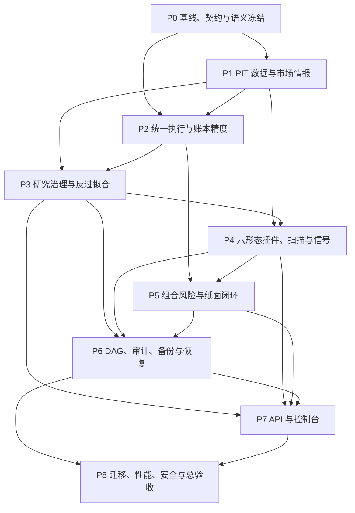

# 个人机构化研究与纸面交易平台 v2.0 实施计划

> **给实现 Agent：** 本计划是执行主文档。开始任何代码前，必须依次阅读[总索引](2026-08-16-institutional-console-v2-index.md)、[设计规格](../specs/2026-08-16-institutional-console-v2-design.md)、[数据/PIT合同](../specs/2026-08-16-institutional-console-v2-data-contract.md)、[六形态策略目录](../specs/2026-08-16-institutional-console-v2-strategy-catalog.md)、[平台合同](../specs/2026-08-16-institutional-console-v2-platform-contracts.md)、[验收矩阵](2026-08-16-institutional-console-v2-acceptance.md)、[Agent 手册](2026-08-16-institutional-console-v2-agent-runbook.md)、仓库根 `AGENTS.md`、`tasks/backlog.yaml` 与 `tasks/implementation_state.yaml`。

| 字段 | 内容 |
|---|---|
| 文档 ID | `PERSONAL-INSTITUTIONAL-CONSOLE-V2-IMPLEMENTATION` |
| 状态 | **待实现** |
| 计划日期 | 2026-08-16 |
| 基线仓库 | `E:\\CODEX\\Stock_selection\\accumulation_breakout` |
| 目标架构 | FastAPI + React + SQLite 模块化单体 |
| 发布边界 | 纸面仿真；`LIVE_TRADING_ENABLED=false` |
| 前置历史 | v1.1 计划保留，但冲突时本计划优先 |

## 0. 执行规则

### 0.1 开始条件

1. 任务必须写入 `tasks/backlog.yaml`，状态为 `ready`，且所有依赖已经 `complete`。
2. Agent 领取任务后，在 `tasks/implementation_state.yaml` 标记执行者、基线 commit 和开始时间。
3. 当前用户已有 `docs/RESEARCH-ROADMAP.md`、`docs/STATUS.md` 修改；除最终集成负责人外禁止覆盖。
4. 新任务从清洁 worktree/分支开始；不得把当前脏工作区伪装为发布候选。
5. P0 必须先重新测量测试数量、Python 版本、数据库 schema、前端构建和浏览器基线。

唯一 bootstrap 例外：用户批准本计划后，集成 Agent 可执行 `V2-P0-BOOTSTRAP`，只把本 v2 文档包和 v2 task DAG 写入一个 planning commit，不修改业务代码。该 commit 完成后，所有实现任务恢复执行上述 `ready` 准入规则。由于当前文档仍为未跟踪文件，派发 clean worktree 前必须先完成该 planning commit；不得把用户已有的 `docs/RESEARCH-ROADMAP.md`、`docs/STATUS.md` 修改混入。

### 0.2 每项任务的固定 TDD 循环

每个任务均执行以下步骤，不得跳过失败测试：

1. 写一个正常行为测试和一个失败/边界测试。
2. 运行精确测试，确认新测试先失败且失败原因正确。
3. 实现最小领域行为，不先改 UI。
4. 运行精确测试、相关模块测试、Ruff 和 Mypy。
5. 更新 API/数据字典/ADR/验收证据。
6. 执行任务级回滚演练。
7. 提交小步 commit，填写 Agent handoff；集成后才更新任务为 `complete`。

### 0.3 全程硬约束

- 任何新研究查询都需要 `decision_at`；所有输入满足 `available_at <= decision_at`。
- 金额、价格和费用不得使用二进制浮点记账。
- 禁止 `INSERT OR REPLACE`；账本和证据只追加，不覆盖。
- 写 API 必须有幂等键、请求哈希和稳定错误码。
- GET 不产生告警、状态转换或审计业务写入。
- 研究模块不得创建订单；信号 PASS 不等于订单 PASS。
- `ENTERED` 只能由 fill 事件产生。
- 测试不得依赖互联网、真实 Token 或真实券商。
- 数据库迁移只新增表或列，重复执行必须成功。
- `LIVE_TRADING_ENABLED=true` 必须使启动和质量门禁失败。
- 破坏性/故障注入测试只能针对经过绝对路径校验的 disposable DB 副本和临时备份根；生产 DB fingerprint 前后必须一致。

共享热点说明：本文后续若把 `web/backend_app.py`、`app_factory.py`、`config.py`、两套 migration/schema 文件或 `paper_trading/orders.py|engine.py|settlement.py|rules.py` 列为“修改”，表示该阶段必须提交**契约、适配器、测试或 migration intent**，不代表 feature Agent 可直接编辑。只有 [Agent 手册](2026-08-16-institutional-console-v2-agent-runbook.md) 指定的唯一 owner 可以落最终 patch。

## 1. 阶段和依赖



并行说明：P2 的纯执行算法可在 P0 后基于 fixture 开发，但接入报价、品种规则和写账前必须完成 P1；P4 的插件契约可在 P1 后开发，但插件 eligibility/晋级集成必须完成 P3；P7 可先用冻结 OpenAPI fixture 制作页面，真实系统集成必须完成 P6。

| 阶段 | 出口定义 |
|---|---|
| P0 | 当前事实被重新测量；V1 语义冻结；契约、错误码、迁移编号与质量门禁确定 |
| P1 | 所有进入信号的数据可以回答“决策时可见哪个版本” |
| P2 | 研究与纸面使用唯一 Decimal/定点撮合核心，逐笔账务零分误差 |
| P3 | 正式研究具备预登记、Nested WF、PBO、DSR、MinTRL、成本与容量硬门 |
| P4 | 六形态通过统一插件契约，扫描/漏斗/信号/outcome 可追溯 |
| P5 | 订单确认使用唯一组合约束，日结固化风险和压力结果 |
| P6 | 每日 DAG 可续跑、审计防篡改、备份可实际恢复 |
| P7 | 初学者和专业用户均可通过控制台完成闭环，状态服务端恢复 |
| P8 | 七闸门全部形成当前身份的机器证据；真实策略未通过时仍显示 FAIL |

---

## P0：事实源、契约、ENTRY 语义和工程护栏

### P0.1 重新冻结真实基线

**影响文件**

- 修改：`tasks/backlog.yaml`、`tasks/implementation_state.yaml`
- 新增：`docs/ACCEPTANCE-V2-P0.md`
- 新增：`scripts/capture_v2_baseline.py`
- 新增：`tests/test_v2_baseline_manifest.py`

**步骤**

1. 记录 Git commit/dirty、Python/Node 版本、schema versions、数据库指纹、当前测试数量和前端产物 hash。
2. 运行现有完整离线门禁，不沿用旧 `350 passed` 文案。
3. 调用 `/api/health`、`/api/release/readiness`、`/api/lab/research-status`，保存结构化基线。
4. 将旧 86/88 分报告标为“历史快照”，删除任何当前 PASS 推导。
5. 生成 `runtime/v2/baseline_manifest.json`，不提交大型 runtime 数据。

**验收**

- manifest 含生成时间、代码、dirty、配置、DB、schema、依赖和测试结果哈希。
- 相同身份重复生成的稳定字段一致；更改代码或配置后 identity 必须变化。
- 工作区脏或 release identity 不一致时状态为 `BLOCKED`。

### P0.2 冻结 ENTRY V1，创建版本注册表

**新增**

- `ab_screener/domain/entry_registry.py`
- `ab_screener/domain/entry_definition_v2.py`
- `docs/ENTRY-DEFINITION-V2.md`
- `tests/test_entry_definition_v1_golden.py`
- `tests/test_entry_definition_v2.py`
- `tests/fixtures/entry_v1_golden.json`

**修改**

- `ab_screener/domain/entry_definition.py`
- `docs/ENTRY-DEFINITION-V1.md`
- `config.py`
- `backtest_signals.py`、`trade_sim.py`
- `ab_screener/research/attribution.py`
- `ab_screener/research/evidence.py`
- `ab_screener/research/backtest_engine.py`

**步骤**

1. 对比冻结文档、现有代码和历史产物，定位 V1 ID 下的语义漂移。
2. 以冻结 V1 文档为契约恢复实现；无法验证的旧报告标记 invalid，不静默重写。
3. 将 MA60、回踩次数等新增含义发布为 V2 定义。
4. 所有消费者通过 registry 显式解析定义，保存 ID 与 semantic hash。
5. 建立 V1/V2 golden fixture 和未知版本 fail-closed 测试。

**验收**

- V1 fixture 输出逐字段和 SHA-256 固定；激活 V2 不改变 V1 结果。
- 报告声明 V1 但 hash 不匹配时拒绝生成。
- 默认仍为 V1，只有独立研究通过后才允许切换生产候选定义。

**回滚**：设置 `ACTIVE_ENTRY_DEFINITION_ID=A_POOL_STRICT_NEXT_OPEN_V1`；V2 数据保留只读。

### P0.3 固化质量门禁与架构边界

**新增**

- `scripts/quality_gate.ps1`
- `scripts/check_architecture.py`
- `tests/test_architecture_boundaries.py`
- `tests/test_live_trading_disabled.py`
- `tests/test_no_replace_sql.py`

**修改**

- `.github/workflows/ci.yml`
- `pyproject.toml`
- `requirements-dev.txt`
- `local_store.py`
- `paper_trading/cal.py`
- `paper_trading/settlement.py`
- `research_status.py`

**步骤与验收**

- 对 API→application→domain/data 依赖做静态测试；API 直接导入 `sqlite3`/`subprocess` 失败。
- 逐阶段收紧 Mypy，最终覆盖 `ab_screener`、`paper_trading`、`logic_platform` 和后端装配层。
- 清除生产代码中的 `INSERT OR REPLACE`，改成受控 upsert 或追加记录。
- Python 发布运行时统一为 3.12；本地 3.14 只能作为兼容附加测试，不得成为唯一证据。
- 使用 `C:\Users\13818\AppData\Local\Programs\Python\Python312\python.exe -m venv .venv312` 创建权威环境，后续所有 Python 命令使用 `.venv312\Scripts\python.exe`。
- 使用 `pip-tools --generate-hashes` 生成并提交 `requirements-lock-py312.txt`；证据记录该文件 SHA-256。Node 记录 `package-lock.json` SHA-256。
- 为 `research_status.py` 新增并测试 `--no-token-probe`；离线 quality gate 使用该参数，真实网络检查只在 release gate 运行。
- 一条命令运行 Pytest、Ruff、Mypy、前端 build 和必要契约检查。

P0 的 `NO_REPLACE_SQL` 清理是 schema steward/集成 Agent 的一次性专属任务；其他 WP 不获得纸面核心文件所有权。

### P0.4 冻结公共契约

**新增**

- `docs/API-CONTRACT-V2.md`
- `docs/ERROR-CODES-V2.md`
- `docs/ADR/ADR-020-v2-module-boundaries.md`
- `docs/ADR/ADR-021-v2-readiness-gates.md`
- `ab_screener/domain/readiness.py`
- `ab_screener/domain/errors_v2.py`
- `ab_screener/application/platform_config.py`
- `ab_screener/data/migration_registry.py`
- `ab_screener/data/schema_check.py`
- `scripts/migrate_v2.py`
- `configs/platform_v2.yaml`
- `requirements-lock-py312.txt`
- `tests/test_error_code_registry.py`
- `tests/test_platform_config.py`
- `tests/test_migration_registry_v2.py`

**内容**

- 七闸门状态、错误 envelope、时间/Decimal 字符串、分页、幂等、请求哈希和版本头。
- 迁移版本由唯一 schema steward 分配；新增 `schema_migrations_v2(migration_id, checksum, applied_at, duration_ms)`，字符串 ID/namespace 统一注册现有 paper 1–8、core 9–13、logic 101+ 与 v2 迁移。不得用 `MAX(schema_version)` 跳过未应用迁移。
- Web 启动只能运行 `assert_schema_compatible()`，不得自动执行大表 DDL/backfill，也不得吞掉 required migration 异常。维护命令固定为 `.venv312\Scripts\python.exe scripts\migrate_v2.py --db <absolute-copy-path> --plan|--apply`。

**版本化 feature flags**

- `V2_PIT_READ_ENABLED=false`：PIT 双写验证后才切正式读；
- `V2_EXECUTION_DUAL_RUN_ENABLED=true`：先只比较旧/新执行核心；
- `V2_EXECUTION_WRITE_ENABLED=false`：parity 通过后才允许新核心写账；
- `V2_STRATEGY_REGISTRY_ENABLED=false`：插件 registry 完整后启用；
- `V2_RISK_ENFORCEMENT_ENABLED=false`：先 observe，再 enforce；
- `DAILY_SCHEDULER_ENABLED=false`：DAG 恢复验收后启用；
- `INSTITUTIONAL_CONSOLE_V2_ENABLED=false`：后端契约和 E2E 通过后启用。

所有 flag 进入 resolved config hash，只能控制新路径切换；资金、份额、T+1、不做空、数据时点和 `LIVE_TRADING_ENABLED=false` 等硬门不得被 flag 绕过。

**P0 出口**：基线证据可复算、V1 golden 稳定、质量门禁全绿、用户现有文档修改未丢失。

---

## P1：Point-in-Time 数据、历史宇宙与市场情报

### P1.1 建立 PIT 数据契约和历史版本表

**新增**

- `ab_screener/domain/data_point.py`
- `ab_screener/data/pit_repository.py`
- `ab_screener/data/pit_writer.py`
- `ab_screener/data/adapters/__init__.py`
- `ab_screener/data/adapters/tushare_pit.py`
- `ab_screener/data/migration_intents/pit_history_v2.py`
- `ab_screener/application/pit_backfill.py`
- `scripts/backfill_pit_v2.py`
- `docs/DATA-DICTIONARY-PIT-V2.md`
- `tests/test_pit_repository.py`
- `tests/test_pit_writer.py`
- `tests/test_pit_backfill_resume.py`

**修改**

- `ab_screener/data/repository.py`
- `local_store.py`、`data_fetch.py`、`sync_daily.py`、`sync_history.py`

**迁移意图**

新增 append-only history/projection：`daily_history`、`daily_basic_history`、`moneyflow_history`、`fina_indicator_history`、`stock_basic_history`、`adj_factor_history`、`raw_ingest_manifests`。业务键加 revision/content hash，统一保存 PIT 五元组。

DDL 与约 517 万行历史回填必须分开：先由 schema steward 注册空表迁移，再按数据集/交易月分块（单事务上限由基准确定，初始建议5万行）回填。`pit_backfill_checkpoints` 保存分区、last key、row count、source hash 和状态；进程中断后从 checkpoint 续跑。开始前要求：已验证备份、维护窗口、目标绝对路径、预计新增空间和 WAL 预算；可用空间至少大于 `2 × 当前DB大小 + 预计新增数据`。覆盖率与抽样 hash 100% 通过后才切 `V2_PIT_READ_ENABLED=true`。

**验收**

- 同一业务键两次修订，在修订前后 `decision_at` 分别返回旧/新版本。
- 缺 `available_at/source/revision` 或回填数据伪装成历史可用时，正式研究拒绝。
- 时间统一为带 `+08:00` 偏移；数据写入和 as-of 读取均有正常/失败测试。
- Tushare adapter 只能复用根 `tushare_init.py`，禁止裸 requests 或第二套 Token/URL 初始化路径。

### P1.2 As-of 股票池和 instrument 规则

**新增**

- `ab_screener/domain/instrument.py`
- `ab_screener/data/instrument_repository.py`
- `ab_screener/data/migration_intents/instrument_history_v2.py`
- `tests/test_instrument_universe_asof.py`
- `tests/fixtures/universe_lifecycle.csv`

**修改**

- `optimizer.py`
- `paper_trading/rules.py`
- `paper_trading/schema.py`

**验收**

- 上市前不进入宇宙，退市股在历史有效期内存在、退市后消失。
- 指数、ETF、孤儿代码不进入首版个股宇宙。
- 缺 instrument rule 的回测或订单返回明确失败，不使用全市场默认值兜底。

### P1.3 复权、公司行为和数据质量门禁

**新增**

- `ab_screener/application/data_quality.py`
- `ab_screener/application/corporate_action_service.py`
- `ab_screener/data/corporate_action_repository.py`
- `ab_screener/data/migration_intents/corporate_actions_v2.py`
- `tests/test_adjustment_asof.py`
- `tests/test_data_quality_v2.py`

**修改**

- `paper_trading/real_data_gate.py`
- `paper_trading/settlement.py`

**验收**

- 重复键、非法 OHLC、负量额均为 0；活跃股票覆盖率 ≥98%，持仓/活动订单/A池为 100%。
- 未处理公司行为阻断估值和日结；调整使用追加冲正。
- 固定种子至少 20 个标的×5日源端比对零差异；无 Token 为 `INSUFFICIENT`/非零退出，不得 PASS。

### P1.4 市场情报领域

**新增**

- `ab_screener/intelligence/__init__.py`
- `ab_screener/intelligence/catalog.py`
- `ab_screener/intelligence/timeline.py`
- `ab_screener/intelligence/events.py`
- `ab_screener/intelligence/breadth.py`
- `ab_screener/intelligence/quality.py`
- `ab_screener/data/intelligence_repository.py`
- `tests/test_intelligence_catalog.py`
- `tests/test_market_breadth.py`
- `tests/test_event_timeline_pit.py`

**内容与验收**

- 形成个股档案、公告/公司行为时间线、市场宽度、行业主题资金和数据来源状态。
- 信息读取与扫描引用同一 snapshot ID；修订后缓存按分区/manifest 失效。
- 信息模块只读，不创建信号或订单。
- 新闻/社交情绪暂不进入正式特征，直至原文归档和 `available_at` 验收完成。

**P1 回滚**：`V2_PIT_READ_ENABLED=false` 仅供诊断；旧路径不得产生 v2 候选。新历史表和 checkpoint 保留不删除。

---

## P2：统一撮合、费用、交易规则与账本精度

### P2.1 唯一执行领域核心

**新增**

- `ab_screener/domain/execution/__init__.py`
- `ab_screener/domain/execution/models.py`
- `ab_screener/domain/execution/fees.py`
- `ab_screener/domain/execution/market_rules.py`
- `ab_screener/domain/execution/fill_model.py`
- `ab_screener/domain/execution/settlement_rules.py`
- `docs/EXECUTION-MODEL-V2.md`
- `tests/test_execution_core_v2.py`
- `tests/test_execution_money_exactness.py`

**修改**

- `ab_screener/domain/costs.py`
- `trade_sim.py`
- `paper_trading/engine.py`
- `paper_trading/orders.py`
- `paper_trading/rules.py`
- `paper_trading/guidance.py`
- `ab_screener/research/backtest_engine.py`
- `ab_screener/research/baselines.py`

**验收**

- 标准买卖、佣金最低值、税费、tick、滑点、FIFO、T+1 可逐项复算，误差为零分。
- 浮点账务输入、未知费用版本、负现金、超卖和重复成交均拒绝。
- 先 `observe/dual-run` 对比旧核心，不一致时不切换写路径。

### P2.2 可成交语义和研究/纸面一致性

**新增测试**

- `tests/test_execution_zero_partial_fill.py`
- `tests/test_execution_temporal_market_rules.py`
- `tests/test_execution_backtest_paper_parity.py`

**规则**

- 无 open、停牌、vol=0、无报价、一字涨停买、一字跌停卖：零成交。
- 最大成交量按版本化参与率，默认 5%，再按交易单位向下取整。
- 滑点价夹在当日高低范围；DAY 实际撮合后的余量过期，停牌不算实际撮合。
- 同日收盘信号按同一收盘成交的任何路径必须失败。

**验收**：同一 fixture 在研究和纸面产生相同订单可成交量、成交价、费用、现金和持仓 hash。

### P2.3 固化执行血缘

**新增 intent**

- `ab_screener/data/migration_intents/execution_lineage_v2.py`

**由 WP50/schema steward 集成修改**

- `paper_trading/schema.py`
- `paper_trading/migrations.py`
- `paper_trading/settlement.py`

成交新增 `fee_breakdown`、rule/cost/fill model version、participation bps、quote available_at、input hash。API 金额和价格均返回十进制字符串。

**P2 回滚**：历史成交不重写；异常时停止新撮合，以 model version 区分；不得回滚现金流水。

---

## P3：实验登记、严格反过拟合、成本容量和晋级

### P3.1 实验 registry 与 trial ledger

**新增**

- `ab_screener/research/registry.py`
- `ab_screener/research/trial_ledger.py`
- `ab_screener/data/research_artifact_repository.py`
- `ab_screener/data/migration_intents/research_governance_v2.py`
- `tests/test_experiment_registration.py`
- `tests/test_trial_ledger.py`

**修改**

- `ab_screener/research/store.py`

新增 `experiment_registrations`、`research_trials`、`research_artifacts`、`promotion_decisions`。失败、取消和被拒绝参数组合同样登记；注册后核心字段不可修改。

### P3.2 正式统计实现

**新增**

- `ab_screener/research/cscv.py`
- `ab_screener/research/deflated_sharpe.py`
- `ab_screener/research/min_track_record.py`
- `ab_screener/research/nested_walkforward.py`
- `tests/test_cscv_pbo.py`
- `tests/test_deflated_sharpe.py`
- `tests/test_min_track_record.py`
- `tests/test_nested_walkforward_v2.py`

**修改**

- `ab_screener/research/validation.py`
- `ab_screener/research/trusted_run.py`
- `optimizer.py`、`walkforward.py`

**验收**

- 已知收益矩阵与手算/参考 fixture 一致。
- 参数只能在训练折选择，测试折只评估一次。
- OOS 参与选择、日期重叠、样本不足或 NaN 返回 FAIL/INSUFFICIENT，不静默降级。

### P3.3 成本、容量和多重试验压力

**新增**

- `ab_screener/research/cost_stress.py`
- `ab_screener/research/capacity.py`
- `tests/test_cost_stress.py`
- `tests/test_capacity_model.py`

**报告固定包含**

- 1×、2×、3×成本；
- 1%、2%、5%、10%成交量参与率；
- 多档账户规模、ADV20、预计退出天数；
- 随机、MA20/60和预登记主要基线；
- 参数邻域、消融和策略家族多重比较。

### P3.4 晋级服务与人话报告

**新增**

- `ab_screener/research/promotion_v2.py`
- `ab_screener/research/artifact_manifest.py`
- `tests/test_promotion_gate_v2.py`
- `tests/test_research_artifact_tamper.py`

**修改**

- `ab_screener/research/evidence.py`
- `ab_screener/research/reporting.py`
- `ab_screener/research/trusted_run.py`

**默认候选口径 `ROBUST_PERSONAL_V2`**

- PBO ≤20%；DSR ≥95%；MinTRL coverage ≥1；
- 至少 5 个有效外层测试窗，正收益窗 ≥60%；
- OOS 净收益为正并优于预登记主基线；
- 2×成本下净OOS>0且对主基线超额>0；
- 预登记参数邻域中 ≥60% 组合的净OOS和主基线超额同为正；所有身份/产物哈希有效。

另生成 `STRICT_RESEARCH_V2` 对照结论：PBO <10%、DSR >95%、MinTRL ≥1。两个 profile 独立命名和报告，不得把 robust 结果称为 strict。

PASS 仅生成 `CANDIDATE`，不得写 A 池或订单。当前真实结果未达到门槛时必须继续输出 FAIL。

**P3 回滚**：旧 personal gate 可继续显示诊断，但永远不能生成 v2 候选。

---

## P4：六形态插件、扫描方案、漏斗和信号生命周期

### P4.1 唯一策略插件契约

**新增**

- `ab_screener/strategies/__init__.py`
- `ab_screener/strategies/contracts.py`
- `ab_screener/strategies/registry.py`
- `ab_screener/strategies/dsl_adapter.py`
- `ab_screener/strategies/accumulation_breakout_v1.py`
- `ab_screener/strategies/volatility_contraction_v1.py`
- `ab_screener/strategies/trend_pullback_v1.py`
- `ab_screener/strategies/platform_breakout_v1.py`
- `ab_screener/strategies/oversold_reversal_v1.py`
- `ab_screener/strategies/relative_strength_high_v1.py`
- `ab_screener/regimes/__init__.py`
- `ab_screener/regimes/contracts.py`
- `ab_screener/regimes/registry.py`
- `ab_screener/regimes/defensive_overlay_v1.py`
- `configs/strategies/accumulation_breakout_v1.yaml`
- `configs/strategies/volatility_contraction_v1.yaml`
- `configs/strategies/trend_pullback_v1.yaml`
- `configs/strategies/platform_breakout_v1.yaml`
- `configs/strategies/oversold_reversal_v1.yaml`
- `configs/strategies/relative_strength_high_v1.yaml`
- `configs/regimes/defensive_overlay_v1.yaml`
- `tests/test_strategy_plugin_contract.py`
- `tests/test_legacy_strategy_parity.py`

**修改**

- 根 `signals.py`、`run_screener.py`
- `logic_platform/structure/adapters_signals.py`

**验收**

- 插件输出 strategy/version/config/input/entry/snapshot hashes、解释和可交易性。
- 每个插件至少有经济假设、失效条件、PIT 测试、golden fixture 和研究状态。
- 一个插件异常被隔离，其他插件继续；未通过研究门禁的插件只能进入实验视图。
- `logic_platform` 经 adapter 使用同一契约，不再建立第二套生产状态机。
- 选择定义与执行时点分离：每个插件有独立 `strategy_definition_id/hash`，共同引用 `NEXT_TRADABLE_OPEN_EXECUTION_V1`；旧组合 ID 只通过兼容 adapter 映射。
- 插件状态机为 `EXPERIMENTAL → REJECTED | CANDIDATE → SHADOW → ACTIVE_FOR_A_POOL → RETIRED`。工程实现只要求六插件完成 EXPERIMENTAL 契约；只有独立 R/S 门禁通过后才能进入 `ACTIVE_FOR_A_POOL`。
- `strategy_registry` 必须恰好注册六个 selection plugin；`regime_overlay_registry` 单独注册一个防守 overlay。测试断言 `len(selection_plugins)==6`，overlay 不实现 `SignalObservation` producer。
- 防守 overlay 不计作第六形态；它只改变开仓许可和 WATCHING 展示，不直接产生买单。

### P4.2 ScanProfile 和真实漏斗

**新增**

- `ab_screener/domain/scan_profile.py`
- `ab_screener/application/scan_funnel.py`
- `ab_screener/application/signal_pipeline.py`
- `ab_screener/data/scan_profile_repository.py`
- `ab_screener/data/signal_repository.py`
- `ab_screener/data/migration_intents/scan_signal_v2.py`
- `ab_screener/api/routers/scan_profiles.py`
- `ab_screener/api/routers/signals.py`
- `tests/test_scan_profiles.py`
- `tests/test_scan_funnel.py`

**修改/集成 intent**

- `ab_screener/application/scan_jobs.py`
- `ab_screener/application/scan_audit.py`
- `scan_job_runner.py`、`run_screener.py`
- `ab_screener/api/scan_router.py`

新增 profile versions、scan funnel DAG、不可变 run manifest。A/B 分支验收使用集合守恒；禁止写死阶段数量。

### P4.3 不可变信号、事件投影与 outcome

**新增**

- `ab_screener/domain/signal_lifecycle.py`
- `ab_screener/application/signal_outcomes.py`
- `tests/test_signal_observations.py`
- `tests/test_signal_lifecycle_v2.py`
- `tests/test_signal_outcomes.py`

**迁移意图**

- `signal_observations`：不可变原始发现；
- `signal_events`：人工与系统事件；
- `signal_lifecycle_projection`：可重建投影；
- `signal_outcomes`：5/10/20日等成熟结果，修订追加版本。

**验收**

- 同 strategy/profile/entry/snapshot/input hash 重跑幂等。
- 不同配置不会互相覆盖；状态表为 `OBSERVED→QUALIFIED→WATCHING|TRADEABLE`，只有 `TRADEABLE→ORDER_CREATED`；`ENTERED` 只由 fill 触发。
- 策略草稿必须保存精确 `signal_observation_id` 或已批准 composite decision ID；人工练习单保存 `manual_exercise=true`，禁止按同代码最近信号猜测关联。
- outcome 的5/10/20表示理论入场后的第N个交易所交易日；起点为统一执行核心得到的下一可交易日开盘成交价，终点为第N日PIT收盘估值，扣预登记往返成本并同时计算基准超额。无法在有效期成交时记录 `UNFILLABLE/EXPIRED`，收益为 NULL，不填0。
- outcome 只能在持有期结束、收盘和复权/公司行为数据已 available 后回填。
- 理论 outcome 与纸面 fill 分开统计。

**P4 回滚**：关闭 v2 registry 后返回 legacy 吸筹突破界面；v2 `ACTIVE_FOR_A_POOL` 列表清空，新表和观察记录保留不删除。

---

## P5：组合约束、风险分析和纸面闭环

### P5.1 唯一组合约束引擎

**新增**

- `ab_screener/domain/risk/__init__.py`
- `ab_screener/domain/risk/models.py`
- `ab_screener/domain/risk/constraints.py`
- `ab_screener/domain/risk/scenarios.py`
- `paper_trading/risk_adapter.py`
- `tests/test_risk_constraints_v2.py`
- `tests/test_order_risk_integration.py`

**修改**

- `paper_trading/orders.py`
- `paper_trading/guidance.py`
- `config.py`

**验收**

- 现金、份额、T+1、单票、行业、主题、相似暴露、持仓数、总仓、最低现金、单日新增、参与率、价格偏离、防守环境、陈旧数据均有独立稳定拒绝码。
- Review 与 confirm 使用相同检查；撮合前复检环境和数据。
- 并发确认同一订单只预留一次；卖出不被买入集中度规则错误拦截。

### P5.2 风险指标和快照

**新增**

- `ab_screener/domain/risk/analytics.py`
- `ab_screener/application/portfolio_risk.py`
- `ab_screener/data/risk_repository.py`
- `ab_screener/data/migration_intents/portfolio_risk_v2.py`
- `configs/risk/robust_personal_v2.yaml`
- `tests/test_risk_metrics.py`
- `tests/test_risk_snapshot_pit.py`

**修改**

- `paper_trading/settlement.py`

**指标**：现金/权重、行业/主题/相关组暴露、TWR、波动、Sharpe、最大回撤、VaR95、CVaR95、集中度和流动性天数。精确窗口、最小样本、分位插值、损失符号、无风险率、年化因子、停牌/缺失处理和相关组阈值由 `robust_personal_v2.yaml` 冻结；风险快照记录行情、规则和配置版本。

**验收**

- 权重含现金合计 `1 ± 1e-8`；手算 fixture 误差 <1bp。
- 缺估值、基准、现金流或最小样本返回证据不足，不返回 0。
- 未来行情注入不能改变历史风险快照。

### P5.3 压力情景和日结集成

**新增**

- `tests/test_portfolio_scenarios.py`
- `tests/test_paper_reconciliation_failures_v2.py`

**情景**：指数 -5%、行业 -10%、相关持仓同步下跌、流动性腰斩、1/2/3×成本、停牌和连续跌停。

日结在同一事务/明确阶段中固化现金、持仓、风险和对账引用。1分钱、1股份额、重复成交或缺估值均必须阻断下一日买入草稿。

**P5 回滚**：风险 V2 可先 `observe` 后 `enforce`；资金、份额、不做空和 T+1 原硬约束永不可关闭。

---

## P6：持久 DAG、统一审计、告警、备份和恢复

### P6.1 持久每日 DAG

**新增**

- `ab_screener/operations/__init__.py`
- `ab_screener/operations/dag.py`
- `ab_screener/operations/scheduler.py`
- `ab_screener/operations/task_registry.py`
- `ab_screener/operations/leases.py`
- `ab_screener/data/scheduler_repository.py`
- `ab_screener/data/migration_intents/operations_v2.py`
- `tests/test_daily_dag.py`
- `tests/test_scheduler_resume.py`
- `tests/test_scheduler_locking.py`

**修改**

- `easy_start.py`、`bootstrap.py`
- `web/backend_app.py` lifespan 集成 intent；最终 hook 由 WP80 owner 落地

**唯一 DAG 顺序**

```text
calendar/lease → sync → PIT gate
→ instrument/company-action gate → 处理此前排队订单的当日开盘撮合
→ 收盘估值/日结/对账 → 市场宽度 → 收盘扫描
→ 信号观察/生命周期 → 成熟 outcome 回填 → 告警/下一日草稿
→ daily manifest → 校验备份
```

调度时区固定 `Asia/Shanghai`。EOD 控制器在交易日 16:15 后、源端最新完成日就绪时运行；周末/节假日不生成新交易日 run。所谓“开盘撮合”是 EOD 对当日开盘行情的确定性历史重放，不伪装实时交易。历史补跑显式使用 `mode=HISTORICAL_REPLAY`，应用重启自动 catch-up 最近未完成交易日。

每个步骤声明 `scope_type=GLOBAL|ACCOUNT|PROFILE` 和 `scope_id`；幂等键为 `trade_date + step_name + scope_type + scope_id + input_hash`。`max_attempts=3` 含首次执行。自动 A池草稿要求对应 plugin/version 为 `ACTIVE_FOR_A_POOL` 且 R/S 门禁通过；R失败时 DAG 仍可完成日结和备份，只跳过自动策略草稿并记录 blocker，不影响人工练习单。

**验收**

- 相同日、scope、步骤和 input hash 最多成功一次。
- 崩溃后从最后完成步骤续跑；`max_attempts=3` 并保留每次 attempt。
- 上游 FAIL 阻断依赖步骤；人工补跑不能绕过数据、研究、风险或对账门禁。
- Windows 进度文件 Access Denied 注入后有限重试或明确失败，不遗留 RUNNING。

### P6.2 事件化告警和全站审计

**新增**

- `ab_screener/operations/alerts.py`
- `ab_screener/application/audit_service.py`
- `ab_screener/data/alert_repository.py`
- `ab_screener/data/audit_repository.py`
- `tests/test_alert_engine.py`
- `tests/test_audit_append_only.py`
- `tests/test_audit_hash_chain.py`
- `tests/test_audit_external_anchor.py`

**规则**

- 数据陈旧、信号过期、止损提醒、公司行为、对账差异、任务失败均由事件或调度步骤产生。
- 所有写 API 记录 actor/action/request/correlation/before/after/hash/时区；敏感字段脱敏。
- GET 轮询不创建告警；重复事件幂等。
- 每日 chain head 使用本机受保护签名密钥签名，并将签名锚定到数据库目录之外的 `AB_BACKUP_ROOT/audit-anchors/`；验证器重新计算链和签名。威胁模型仅承诺检测DB局部篡改，不宣称抵抗同时控制主机管理员、密钥和锚点的攻击者。

### P6.3 备份、恢复和健康

**新增**

- `ab_screener/operations/backup.py`
- `ab_screener/operations/health.py`
- `scripts/restore_backup.ps1`
- `scripts/soak_monitor_v2.py`
- `docs/BACKUP-RESTORE-RUNBOOK-V2.md`
- `tests/test_backup_restore.py`
- `tests/test_system_health.py`

**验收**

- 使用 SQLite online backup；临时备份完成 foreign key、行数、关键表 hash 后原子命名。
- 至少连续七份；最近成功备份 <24h；RPO ≤1交易日、恢复演练 RTO ≤30分钟。
- 磁盘不足、损坏或 hash 不符不更新 last good，也不删除唯一可用备份。
- 健康状态包含 build/config/data、DB/WAL/磁盘、DAG、备份、扫描、对账和端口身份；日志无 Token。
- `AB_BACKUP_ROOT` 必须由用户配置为不在活动数据库目录内的第二卷或独立同步目录；若缺失/不可写，O 门禁为 INSUFFICIENT/FAIL。七份约2.5GB以上数据库加PIT增长必须先做空间预算，保留策略不得删除唯一已验证备份。
- soak 证据写入 `runtime/v2/soak/<trade_date>.json`；不足5个不同完成交易日时 O-12 固定为 INSUFFICIENT，不允许 Agent 伪造等待结果。

### P6.4 持仓同步时间语义纠错

**本仓库新增只读适配器**：`ab_screener/integrations/holdings_state.py`、`tests/test_holdings_state_adapter.py`。它读取父工作区 `E:\CODEX\Stock_selection\runtime\holdings_sync_state.json`，但不得写父目录。

字段拆分为 `poll_attempted_at`、`source_snapshot_at`、`last_successful_sync_at`、`cache_restored_at`、`updated_at`。失败轮询或恢复缓存不得更新成功同步时间；`stale_local_cache` 明确阻断相关就绪状态。

真实 writer 位于宿主仓库外的 `E:\CODEX\Stock_selection\discord_holdings_watcher.py` / `daily_stock_report.py`。修正 writer 是独立跨仓任务 `HDG-01`，需要用户另行授权和父项目测试；未授权前本仓库 adapter 将旧 `synced_at` 保守映射为 unknown/stale，因此 O 闸门不能 PASS。

**P6 回滚**：`DAILY_SCHEDULER_ENABLED=false` 停止自动触发；手工安全命令保留，所有已写事件和备份保留。

---

## P7：API 拆分和个人机构化控制台

### P7.1 后端路由拆分

**新增**

- `ab_screener/api/routers/desk.py`
- `ab_screener/api/routers/intelligence.py`
- `ab_screener/api/routers/strategies.py`
- `ab_screener/api/routers/monitor.py`
- `ab_screener/api/routers/research.py`
- `ab_screener/api/routers/paper.py`
- `ab_screener/api/routers/risk.py`
- `ab_screener/api/routers/review.py`
- `ab_screener/api/routers/system.py`
- `tests/test_openapi_contract_v2.py`

**修改**

- `ab_screener/api/app_factory.py`
- `ab_screener/api/scan_router.py`
- `web/backend_app.py`

**验收**

- `backend_app.py` 只保留兼容、装配和静态资源；路由不直接 SQL/Popen。
- 原 API 契约保留一个版本周期；重复 path 检查为 0。
- 架构验收依据 import/layer contract，不以单纯 LOC 判定。

**v2 最小公共 API**

| 方法与路径 | 用途 |
|---|---|
| `GET /api/v2/readiness` | 七闸门、阻断原因和证据身份 |
| `GET /api/v2/desk` | 今日唯一动作和全局摘要 |
| `GET /api/v2/intelligence/search` | 代码、名称、拼音全拼/首字母、行业、主题搜索 |
| `GET /api/v2/intelligence/stocks/{ts_code}` | 指定 as-of 的个股档案 |
| `GET /api/v2/intelligence/stocks/{ts_code}/timeline` | 公告、公司行为、信号和纸面事件时间线 |
| `GET /api/v2/intelligence/events` | 公告与公司行为日历 |
| `GET /api/v2/intelligence/breadth` | 市场宽度和风险环境 |
| `GET /api/v2/intelligence/data-status` | 数据来源、覆盖率、版本和时点 |
| `GET /api/v2/strategies` | 六形态 registry 和研究状态 |
| `GET /api/v2/strategies/{strategy_id}/versions` | 插件版本、假设和失效条件 |
| `GET/POST /api/v2/scan-profiles` | 版本化扫描方案；POST 幂等 |
| `POST /api/v2/scans` | 以 profile/version 启动扫描 |
| `GET /api/v2/scans` | 分页查询运行历史 |
| `GET /api/v2/scans/{run_id}` | 状态、进度、identity 和 artifact |
| `POST /api/v2/scans/{run_id}/cancel` | 取消扫描并收口持久状态 |
| `GET /api/v2/scans/{run_id}/funnel` | 真实分支漏斗和过滤原因 |
| `GET /api/v2/signals` | 按形态、状态、日期和代码分页查询 |
| `GET /api/v2/signals/{signal_id}/events` | 不可变生命周期和 outcome |
| `POST /api/v2/signals/{signal_id}/transitions` | 受控人工状态事件，写审计 |
| `GET/POST /api/v2/research/experiments` | 实验登记和查询 |
| `POST /api/v2/research/experiments/{id}/runs` | 启动正式验证，幂等 |
| `GET /api/v2/research/runs/{run_id}` | 进度、统计和 artifact manifest |
| `POST /api/v2/research/runs/{run_id}/cancel` | 取消长任务 |
| `GET /api/v2/portfolio/risk` | 暴露、风险、流动性和证据不足项 |
| `POST /api/v2/portfolio/stress` | 只读压力计算，不改账本 |
| `GET /api/v2/compare` | 同一 snapshot 下2–6股对比 |
| `GET /api/v2/review/attribution` | 归因任务和结果 |
| `GET/POST /api/v2/review/notes` | idea ledger/research note |
| `GET/POST /api/v2/review/decisions` | 人工决策日志 |
| `GET /api/v2/review/weekly` | 版本化周报 |
| `GET /api/v2/alerts` | 告警分页和未读数 |
| `POST /api/v2/alerts/{alert_id}/read` | 幂等已读事件 |
| `POST /api/v2/alerts/read-all` | 按过滤条件幂等已读 |
| `GET /api/v2/operations/dag/{trade_date}` | DAG、attempt、租约和阻断原因 |
| `POST /api/v2/operations/dag/{trade_date}/run` | 幂等补跑，不绕门禁 |
| `GET /api/v2/system/evidence` | manifest 和 artifact 校验状态 |
| `GET /api/v2/system/backups` | 备份及恢复演练状态 |
| `GET /api/v2/system/health` | DB/WAL/磁盘/DAG/端口身份 |
| `GET /api/v2/system/audit` | 审计查询；无删除/改写API |
| `GET /api/v2/exports/{artifact_id}` | CSV/JSON/Markdown不可变导出 |

现有 `/api/paper/account|dashboard|orders|orders/review|orders/drafts|fills|cycles|reconciliation|corporate-actions|gates` 接口保持兼容并进入同一 OpenAPI 审计矩阵，不复制第二套 v2 账本接口。信息查询必须传 `snapshot_id` 或 `decision_at`；两者同时提供但身份不一致返回 `SNAPSHOT_DECISION_CONFLICT`。响应返回 source/revision/effective_at/available_at/ingested_at。

所有列表均为游标或页码分页；所有时间为带时区 ISO 8601；金额和价格为十进制字符串。所有 POST 写操作要求 `Idempotency-Key` 和请求哈希，压力测试等纯只读 POST 必须在契约中明确 `side_effects=false`。完整字段、状态、保留期和错误码以 [平台契约](../specs/2026-08-16-institutional-console-v2-platform-contracts.md) 为准。

### P7.2 拆分前端 API、类型和大页面

**新增**

- `web/frontend/src/api/core.ts`
- `web/frontend/src/api/desk.ts`
- `web/frontend/src/api/intelligence.ts`
- `web/frontend/src/api/strategies.ts`
- `web/frontend/src/api/signals.ts`
- `web/frontend/src/api/research.ts`
- `web/frontend/src/api/paper.ts`
- `web/frontend/src/api/risk.ts`
- `web/frontend/src/api/system.ts`
- `web/frontend/src/types/common.ts`
- `web/frontend/src/types/desk.ts`
- `web/frontend/src/types/intelligence.ts`
- `web/frontend/src/types/strategies.ts`
- `web/frontend/src/types/signals.ts`
- `web/frontend/src/types/research.ts`
- `web/frontend/src/types/paper.ts`
- `web/frontend/src/types/risk.ts`
- `web/frontend/src/types/system.ts`
- `web/frontend/src/hooks/useServerTask.ts`
- `web/frontend/src/hooks/useApiError.ts`
- `web/frontend/src/hooks/useFeatureFlag.ts`
- `web/frontend/src/components/common/StatusStrip.tsx`
- `web/frontend/src/components/common/ApiErrorPanel.tsx`
- `web/frontend/src/components/common/EmptyState.tsx`
- `web/frontend/src/components/common/ConfirmDialog.tsx`
- `web/frontend/src/components/common/DataFreshness.tsx`
- `web/frontend/vitest.config.ts`
- `web/frontend/playwright.config.ts`
- `web/frontend/src/test/setup.ts`
- `web/frontend/tests/e2e/closed_loop.spec.ts`
- `web/frontend/tests/e2e/accessibility.spec.ts`
- `web/frontend/tests/e2e/task_recovery.spec.ts`
- `scripts/run_browser_acceptance.ps1`

**修改**

- `web/frontend/src/api/client.ts`
- `web/frontend/src/pages/StrategyLab.tsx`
- `web/frontend/src/pages/Overview.tsx`
- `web/frontend/src/pages/PaperTrading.tsx`
- `web/frontend/src/pages/BacktestStudio.tsx`
- `web/frontend/package.json`
- `web/frontend/package-lock.json`

加入 Vitest、Testing Library、`@playwright/test` 与 `@axe-core/playwright`，`package.json` 固定 `test`、`test:e2e`、`test:a11y` scripts。`run_browser_acceptance.ps1` 构建前端、以隐藏窗口启动本任务拥有的8001后端、验证AB端口身份、运行 Chromium E2E，并只停止自己记录的 PID。引导流程不得使用 `Record<string, unknown>` 表示核心研究或账务对象；任务刷新/切页/失焦后从服务端恢复。

### P7.3 新页面与闭环交互

**新增页面**

- `web/frontend/src/pages/Desk.tsx`：`/desk`
- `web/frontend/src/pages/Screener.tsx`：`/screener`
- `web/frontend/src/pages/Intelligence.tsx`：`/intelligence`
- `web/frontend/src/pages/StrategyLibrary.tsx`：`/strategies`
- `web/frontend/src/pages/Monitor.tsx`：`/monitor`
- `web/frontend/src/pages/Compare.tsx`：`/compare`
- `web/frontend/src/pages/Review.tsx`：`/review`
- `web/frontend/src/pages/System.tsx`：`/system`

**由 WP70 shell owner 修改**：`web/frontend/src/App.tsx`、`web/frontend/src/layout/Sidebar.tsx`、`web/frontend/src/layout/Topbar.tsx`、`web/frontend/src/styles/theme.css`、现有 `/lab` 与 `/paper`。

**验收**

- Desk 只给一个服务端推导的下一动作。
- 信息中心显示来源、版本、available_at 和是否过期。
- 多形态候选展示独立证据，不直接相加分数。
- 研究区始终“研究·非下单”；纸面页始终“不会向券商下单”。
- 桌面和 390px、键盘、可见焦点、网络错误、空状态、旧缓存和结构化错误 E2E 全覆盖。

### P7.4 Review 与决策台账

**新增**

- `ab_screener/application/review_service.py`
- `ab_screener/data/research_note_repository.py`
- `tests/test_review_api.py`
- `tests/test_research_notes.py`

研究假设、人工决策、候选晋级、影子结果、纸面归因和退役原因统一引用 run/signal/order IDs。长任务必须可查询、可取消和可恢复，不能“至少能看进度”即算通过。

**P7 回滚**：`INSTITUTIONAL_CONSOLE_V2_ENABLED=false` 返回旧页面；数据库新记录不删除。

---

## P8：迁移、性能、安全、文档和最终验收

### P8.1 Schema steward 集成迁移

**唯一负责人修改**

- `ab_screener/data/migrations_v2.py`
- `paper_trading/migrations.py`
- `paper_trading/schema.py`

**验收场景**

1. 空库迁移；
2. 当前约 2.48GB/约517万日线行数据库的已验证副本迁移；
3. 重复迁移；
4. 中途故障后重试；
5. 外键、索引、schema checksum 和原表行数验证。

所有命令先解析并打印绝对路径，确认目标不等于生产数据库；迁移前后生产 DB fingerprint 必须一致。禁止反向删表；迁移失败必须保留原数据库可启动。DDL、分块 backfill 和读路径切换分别留证。

### P8.2 性能和并发预算

在固定硬件和数据快照上测 p50/p95/p99，报告冷/热缓存：

- `/api/health` 热 p95 <200ms；
- Desk 热 p95 <500ms；
- Overview 100候选响应 <300KB、热 p95 <500ms、冷 p95 <2.5s；
- 100持仓摘要 p95 <500ms；
- 1000订单分页 p95 <500ms；
- 扫描与研究子进程不得阻塞 API 事件循环；
- SQLite 并发确认、日结、状态轮询和备份无锁死。

新增 `tests/test_performance_v2.py`（`@pytest.mark.performance`）和基准 JSON；结果必须绑定机器、代码、配置、数据和并发参数。

### P8.3 本机安全和供应链

- 服务默认只绑定 `127.0.0.1`；限制 CORS/Origin，写请求校验 CSRF/同源策略。
- Token 不进入仓库、日志、URL、报告或浏览器；增加 secret scan。
- 生成 Python/Node 依赖清单或 SBOM，执行依赖审计并记录例外。
- 新增 `SECURE-DATA-TRANSPORT` 子任务：优先使用供应商 HTTPS；否则使用只绑定 localhost 的受信 TLS 隧道/代理并验证证书。自定义明文 HTTP 数据地址在 TLS/可信隧道前使 G 闸门 FAIL、总状态 BLOCKED，不能只显示提示后全绿。
- 审计链篡改、启用 LIVE、串台到 8000/AETF 均阻断发布。

### P8.4 文档同步

**新增**

- `docs/ARCHITECTURE-V2.md`
- `docs/RESEARCH-GATE-V2.md`
- `docs/RISK-MODEL-V2.md`
- `docs/OPERATIONS-RUNBOOK-V2.md`
- `docs/ROLLBACK-V2.md`
- `docs/ACCEPTANCE-V2-FINAL.md`

**核对并最终更新（已在早期阶段创建）**：`docs/API-CONTRACT-V2.md`、`docs/DATA-DICTIONARY-PIT-V2.md`、`docs/EXECUTION-MODEL-V2.md`。

**最终集成时修改**：`README.md`、`AGENTS.md`、`docs/STATUS.md`、`docs/操作手册.md`、`docs/小白使用手册.md`、`docs/RESEARCH-ROADMAP.md`、`tasks/backlog.yaml`、`tasks/implementation_state.yaml`。必须先合并用户现有文档修改，禁止覆盖。

### P8.5 全量质量门禁

```powershell
.venv312\Scripts\python.exe -m pytest -q
.venv312\Scripts\python.exe -m ruff check . --exclude web/frontend/node_modules
.venv312\Scripts\python.exe -m mypy ab_screener paper_trading logic_platform web/backend_app.py
.venv312\Scripts\python.exe research_status.py --no-token-probe
npm --prefix web/frontend ci
npm --prefix web/frontend run test
npm --prefix web/frontend run build
npm --prefix web/frontend exec playwright install chromium
powershell -NoProfile -File scripts/run_browser_acceptance.ps1
.venv312\Scripts\python.exe -m pytest -q -m performance
.venv312\Scripts\python.exe -m pytest -q -m fault_injection
powershell -NoProfile -File scripts/restore_backup.ps1 -VerifyOnly
```

离线门禁必须覆盖根目录和 `tests/` 下所有可收集测试。真实 Token 只用于独立 release gate：`.venv312\Scripts\python.exe -m paper_trading.real_data_gate --days 730 --report runtime/gates`。五交易日观察由 `scripts/soak_monitor_v2.py` 每个完成交易日追加证据；第五日之前 O-12 保持 INSUFFICIENT。

### P8.6 最终状态

最终聚合规则为 `FAIL > INSUFFICIENT > PASS`。七闸门全部 PASS、各自满足验收矩阵规定的有效期、发布总索引 ≤24h、代码/配置/数据/数据库/报告身份一致、工作区清洁，才允许：

```text
PERSONAL_INSTITUTIONAL_READY
```

只有 D/S/P/L/O/G 全 PASS 且 R 单独未通过时，工程完成后的总状态才是 `ENGINEERING_READY_RESEARCH_BLOCKED`。若 G（含明文传输）、D、L 或 O 仍失败，总状态必须是 `BLOCKED`。不得修改阈值、隐藏失败实验或用旧证据宣布完成。

## 2. 实现完成后的交付物

- 所有任务的 commit/patch 和 Agent handoff；
- schema migration manifest；
- OpenAPI 与 TypeScript 契约；
- 七闸门 JSON、总证据索引和 SHA-256；
- 数据/PIT、研究、成交、风险、调度、备份与浏览器测试报告；
- 真实数据门禁报告；
- UTF-8 日报和研究/晋级报告；
- 已演练的回滚和恢复记录；
- 明确的未通过项和已知限制。

最终检查由独立审计 Agent 执行；实现 Agent 不得自行把自己的任务标记为最终验收通过。
