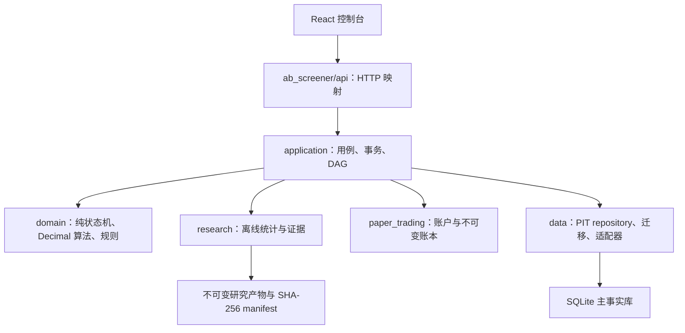
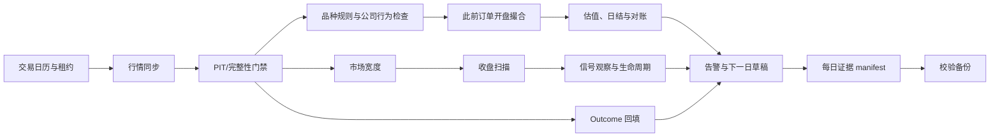

# 个人机构化研究与纸面交易平台 v2.0 设计规格

| 字段 | 内容 |
|---|---|
| 文档 ID | `PERSONAL-INSTITUTIONAL-CONSOLE-V2-DESIGN` |
| 版本 | `2.0.0-design` |
| 状态 | **设计已批准；尚未实现** |
| 批准日期 | 2026-08-16 |
| 宿主仓库 | `E:\\CODEX\\Stock_selection\\accumulation_breakout` |
| 替代关系 | v2.0 实施时替代 `../plans/2026-08-11-institutional-console-upgrade.md` 的执行口径；旧文档保留为历史依据 |
| 实盘边界 | `LIVE_TRADING_ENABLED=false`，永久禁止券商真实下单 |

## 1. 决策摘要

v2.0 定义为本机单用户的**个人机构化研究与纸面交易系统**，不是机构生产交易平台，也不是多租户 SaaS。升级路线采用“可信度优先、增量演进”：保留 FastAPI、React、SQLite 和模块化单体，先修正数据时点、研究统计、成交语义、账本不可变性和证据有效期，再建设多形态选股、组合风险、持久调度和控制台。

系统是否完成不再使用“机构覆盖率 85%”之类不可复算百分比，而由七个互不抵消的硬闸门判定：

- `D`：数据与 Point-in-Time；
- `R`：研究可信度；
- `S`：信号与策略治理；
- `P`：组合与风险；
- `L`：纸面账本与对账；
- `O`：运维、调度与恢复；
- `G`：治理、安全与审计。

只有七项同时为 PASS，且证据与当前代码、配置和数据身份一致，系统才可显示 `PERSONAL_INSTITUTIONAL_READY`。

能力与总状态分开表达：

- `capabilities.research_ready = D/R/S/G 全 PASS`；
- `capabilities.paper_engine_ready = D/S/P/L/O/G 全 PASS`；
- `capabilities.personal_institutional_ready = 七闸门全 PASS`。

互斥总状态按固定优先级计算：

1. 七闸门全 PASS → `PERSONAL_INSTITUTIONAL_READY`；
2. D/S/P/L/O/G 全 PASS 且 R 非 PASS → `ENGINEERING_READY_RESEARCH_BLOCKED`；
3. D/R/S/G 全 PASS → `RESEARCH_READY`；
4. 其他 → `BLOCKED`。

`paper_engine_ready` 只说明纸面引擎可用，不等于策略可用；研究候选生成的纸面买单仍要求 R 闸门通过。

## 2. 当前事实基线

以下是 2026-08-16 审计事实，不是 v2.0 完成结论：

- 本地 `research_status` 曾报告 974 个交易日，而最近签名真实数据门禁报告为 968 个交易日；P0 必须用同一数据库和 identity manifest 重新核对。日线主表已有 PIT 字段，资金流、估值和财务表尚未形成完整修订版本链。
- 现有研究支持净成本 IS/OOS、三段 Walk-Forward、随机与均线基线，但严格反过拟合仍未通过。
- 当前权威旧证据中 PBO 为 40%、DSR 为 54.66%、MinTRL 覆盖率为 3.3218；真正阻断是 PBO、严格 DSR 与嵌套 OOS 稳定性，不是 MinTRL。
- 最近完整 600 股实验为 FAIL；工程闭环通过不等于策略具有可用 edge。
- 纸面账户、订单、成交、FIFO 批次、T+1、日结与对账已存在，但统一撮合精度、不可变更正和组合风险仍需增强。
- 旧机构/商业证据生成于 2026-07-18，审计时已老化约 29 天；不得继续显示为当前 PASS。
- 发布就绪检查明确存在 `WORKTREE_DIRTY` 和 `CODE_VERSION_MISMATCH`；真实门禁代码身份与当前运行构建不一致，当前只能视为研究/纸面基线。
- `docs/RESEARCH-ROADMAP.md` 与 `docs/STATUS.md` 已有用户未提交修改，v2 Agent 不得覆盖。

P0 必须重新运行测试和证据生成命令，不得沿用“350 tests”或旧日期作为新基线。

## 3. 目标与非目标

### 3.1 必须形成的闭环


### 3.2 明确不做

- 不连接券商，不增加真实 OMS，不提供融资融券、做空或自动止损下单。
- 不为本地单用户提前拆微服务或引入多租户/RBAC。
- 不把研究 PASS 自动转换为 A 池、订单或成交。
- 不以当前股票列表回填历史宇宙，不在缺少开盘报价时用收盘价成交。
- 不把合成、教程或旧证据描述为当前可实现收益。
- 不用页面数量、代码行数或平均分替代可执行验收。

## 4. 模块化单体边界



强制依赖规则：

- `domain/` 不得导入 FastAPI、SQLite、Tushare，不读环境变量。
- `application/` 依赖领域接口和 repository protocol，不直接依赖供应商 SDK。
- `data/` 承担 SQLite、PIT 查询、外部适配器和修订写入；Tushare 初始化仍由受控适配器统一完成。
- `research/` 不得创建订单或改纸面账本。
- `paper_trading/` 只能调用统一执行和风险核心，不再复制费用、滑点或仓位公式。
- `api/` 不得直接执行 SQL、Popen 或 DataFrame 业务计算。
- 前端不计算现金、费用、成交、VaR 或门禁结果，只渲染服务端十进制字符串和结构化检查。
- 根目录遗留脚本在迁移期作为兼容 façade，所有新领域逻辑进入包内。

## 5. 数据与市场情报设计

### 5.1 PIT 五元组

所有进入信号、研究、估值或成交判断的数据必须保存：

- `effective_at`：数据描述的经济时点；
- `available_at`：真实世界最早可使用时点；
- `ingested_at`：进入系统的时间；
- `source`：来源；
- `revision` / `source_version`：修订版本。

正式读取必须显式传入 `decision_at`，统一应用 `available_at <= decision_at`。历史回填数据不能伪装成当时已可用；保守回填需要独立来源标记和可用时点规则。

### 5.2 历史股票池

个股研究宇宙按每个交易日生成：

```text
list_date <= trade_date < delist_date
```

并结合当时的品种类型、ST、停复牌、交易规则和公司行为。指数、ETF 与孤儿代码不得混入 A 股个股策略；退市股在历史有效期内必须保留。

### 5.3 数据情报层

首批覆盖行情、复权、资金流、估值、财务质量、公司行为、公告事件、行业/主题、指数历史成分、市场宽度和交易状态。数据流为：

```text
供应商适配器 → 不可变原始响应 → PIT 标准化 → 质量门禁
→ 公共特征仓 → 策略插件 / 个股档案 / 事件日历 / 市场宽度
```

Tushare 可以是当前主要来源，但供应商字段不能进入领域接口。适配器必须复用仓库根 `tushare_init.py` 的受控初始化，不得再次创建裸 SDK/requests 数据路径。Token、自定义地址和账户信息只能从本机安全配置读取，不写入代码、报告、日志或测试 fixture。当前自定义 HTTP 地址属于传输安全降级项；在获得 TLS 或可信隧道前，安全闸门不得宣称完全通过。

### 5.4 缓存规则

- SQLite 和不可变原始文件是事实源；Parquet 只能是带分区哈希的可重建缓存。
- 禁止恢复日级 pickle 双事实路径。
- 数据修订后，所有受影响缓存按数据集 manifest 自动失效。
- 信息页、扫描、回测和纸面预览必须引用同一 PIT snapshot ID。

## 6. 交易语义与统一执行核心

### 6.1 入场定义版本

- `A_POOL_STRICT_NEXT_OPEN_V1` 按冻结文档恢复并建立 golden fixture。
- 若现有代码在 V1 ID 下混入 MA60、回踩次数等新条件，必须恢复 V1 契约；新增条件发布为 V2 ID。
- 每个报告、信号、订单和成交记录 `entry_definition_id` 与语义哈希。
- 不能匹配语义哈希的旧报告标记为失效并重跑，禁止静默改名。

### 6.2 执行模型

研究、基线、回测和纸面交易使用同一纯计算核心：

- 现金及费用为整数分；价格为定点整数或 Decimal；数量为整数股。
- 无开盘价、停牌、成交量为零、一字涨停买入或一字跌停卖出均为零成交。
- 参与率、整手、tick、价格区间、滑点、佣金、税费、T+1 均来自 instrument-level 版本化规则。
- 支持零成交、部分成交、顺延和 DAY 余量过期。
- 收盘信号最早只能在后续可交易日开盘成交。

固定输入下，研究与纸面逐笔成交、现金和权益哈希必须完全一致。

## 7. 研究治理

### 7.1 实验预登记

正式实验运行前冻结经济假设、失效条件、数据集、历史宇宙、窗口、参数空间、试验数量、基线、成本、容量、主指标、晋级阈值和随机种子。临时探索标记 `EXPLORATORY`，不得晋级。

### 7.2 可信验证流水线

```text
PIT 数据检查 → 实验登记 → IS 选择 → 独立 OOS
→ 嵌套 Walk-Forward → 随机/均线基线 → 成本/容量压力
→ PBO/DSR/MinTRL → CANDIDATE / REJECTED / INSUFFICIENT_EVIDENCE
```

默认稳健个人候选门槛：PBO ≤20%、DSR ≥95%、MinTRL 覆盖率 ≥1、嵌套 WF 正收益折 ≥60%、净 OOS 为正并优于预登记主基线、2×成本净 OOS 与主基线超额均保持为正。阈值由版本化 `ROBUST_PERSONAL_V2` profile 固化。另保留更严格的研究对照 `STRICT_RESEARCH_V2`：PBO <10%、DSR >95%、MinTRL ≥1；两个 profile 不得混名，禁止创建 `STRICT_PERSONAL` 别名，修改阈值必须创建新版本。

工程实现完成不代表真实策略通过；真实结果未过时必须稳定输出 FAIL。

### 7.3 不可变产物

每次实验保存 trial ledger、输入 manifest、所有参数结果、失败/取消状态、统计结果、报告和 SHA-256。晋级/拒绝/退役都是追加决策，不覆盖历史记录。

## 8. 多形态选股与信号治理

### 8.1 插件契约

每个策略插件声明 `strategy_id/version`、经济假设、所需数据、决策时点、股票池、特征、参数、信号规则、退出假设、预期持有期和失效条件。输入为 PIT snapshot，输出不可变 `SignalObservation`。

首批六种选股形态：

1. 吸筹突破；
2. 缩量收敛后突破；
3. 趋势回踩再启动；
4. 放量平台突破；
5. 超跌反转；
6. 相对强势新高突破。

防守观察池不是第六种价格形态，而是独立的市场环境 overlay：弱市时阻断新增买入，并把相对强势标的保留为 WATCHING。

未经完整研究门禁的插件只能显示“实验”，不得进入 A 池或生成订单。`logic_platform` 作为实验 DSL，通过适配器进入唯一生产插件契约，不另建第二套策略事实源。

### 8.2 扫描与漏斗

```text
历史有效股票池 → 数据完整 → 流动性/可交易性预筛 → 公共特征
→ 六插件独立识别 → 各插件独立评分 → A/B 分类 → 跨插件合并展示
```

A/B 是分支，验收采用 DAG 守恒，不强制所有阶段线性单调。同一股票命中多个形态时保留所有原始观察；只有经过预登记验证的组合策略才能合并分数。

### 8.3 生命周期

```text
OBSERVED → QUALIFIED → WATCHING | TRADEABLE
TRADEABLE → ORDER_CREATED → CONFIRMED → ENTERED → EXITED
任一允许来源 → EXPIRED | INVALIDATED
```

只有 `TRADEABLE` 可以创建策略订单；`ENTERED` 只能由实际 fill 触发。取消、拒单和部分成交是订单事件，不反向覆盖原始信号。扫描重复运行不能覆盖已成交/已退出状态；原始观察与生命周期投影分表保存。GET 请求始终只读，告警由事件消费者或调度步骤生成。

## 9. 组合风险与纸面账本

### 9.1 唯一约束引擎

订单 review、confirm、撮合前复检和历史回放共用同一约束引擎。默认保守配置：单票 ≤10%、总仓 ≤80%、现金 ≥10%、单日新增 ≤20%、行业/主题 ≤25%、高相关组 ≤30%、参与率 ≤5%。未解决阻断级对账、数据陈旧或公司行为未处理时禁止新增买入。

### 9.2 风险指标

服务端计算现金和暴露、TWR、波动率、最大回撤、Sharpe、历史 VaR95/CVaR95、集中度、流动性退出天数、费用/滑点贡献和压力情景。MWR/XIRR 只有在外部现金流完整时计算；样本不足返回 `INSUFFICIENT_EVIDENCE`，不得返回 0 冒充安全。

### 9.3 纸面状态与账本

订单保持 `DRAFT → CONFIRMED → QUEUED → FILLED | PARTIALLY_FILLED_EXPIRED | EXPIRED | REJECTED`。确认后的订单不可编辑；账本错误使用追加冲正。生产代码禁止 `INSERT OR REPLACE`；可变投影仅允许 `ON CONFLICT DO UPDATE` 白名单字段。

任意历史开市日模拟必须自动构造合法的决策日和下一开盘成交关系，展示当时可见数据、费用、容量和风险检查，并标识 A 池信号或人工练习。

## 10. 运维、调度与恢复

唯一每日 DAG：



每步唯一键为 `trade_date + step_name + scope_type + scope_id + input_hash`，其中 `scope_type=GLOBAL|ACCOUNT|PROFILE|ACCOUNT_PROFILE`。相同输入重跑返回原结果；不同输入生成新 attempt。步骤持久化、带租约，`max_attempts=3`（含首次），支持重启续跑和人工补跑，但人工补跑不能绕过门禁。

备份使用 SQLite online backup API，完成 WAL 一致性和 SHA-256 校验，至少保留连续七份；目标 RPO ≤1 个交易日、RTO ≤30 分钟，必须定期实际恢复而非只比较文件存在。

## 11. 控制台信息架构

v2 页面：

- `/desk`：今日唯一动作、市场宽度、数据/扫描/订单/对账状态；
- `/screener`：扫描方案、真实漏斗和多形态候选；
- `/intelligence`：全局搜索、个股档案、事件日历、行业资金与数据来源；
- `/strategies` 与 `/lab`：策略库、实验登记、运行和可信报告；
- `/monitor`：信号生命周期、告警与 outcomes；
- `/paper`：账户、订单、持仓、风险、成交和对账；
- `/compare`：同一 as-of 下 2–6 个标的对比；
- `/review`：归因、假设、决策和周报；
- `/system`：数据、任务、证据、备份、磁盘、版本和发布状态。

首次默认引导模式，专业模式保留。任务状态来自服务端，浏览器本地存储只保存界面偏好。核心界面不得显示原始 JSON、英文状态或把旧缓存称为实时。

## 12. 审计与证据身份

所有写操作产生 append-only 审计事件，包含 actor、action、request_id/correlation_id、before/after、时区时间戳、前序哈希和当前哈希；敏感字段在进入审计前脱敏。

每次研究、扫描、日结和发布 manifest 至少包含：

- Git commit 与 dirty 状态；
- 构建版本与依赖锁哈希；
- resolved config 哈希；
- 数据集、PIT 宇宙和数据库指纹；
- schema、入场、成本、撮合、风险和插件版本；
- 输入/输出 artifact SHA-256；
- 生成时间、有效期和替代关系。

代码、配置、数据或报告身份不一致，或者任一证据超过验收矩阵为该闸门规定的有效期时，发布状态必须 fail-closed。24 小时固定适用于真实数据发布报告、最近验证备份和 G 发布总索引；研究产物按冻结身份和复验周期失效。

## 13. 兼容与回滚原则

1. 数据库迁移只新增表或列，不执行破坏性 down migration。
2. 旧 API 至少保留一个版本周期；新能力通过 feature flag 隔离。
3. V1 报告、信号和账本保持只读；V2 使用明确版本，不重写历史。
4. 账本只允许追加冲正；研究结论只允许追加替代决策。
5. 调度器可通过 `DAILY_SCHEDULER_ENABLED=false` 停止，手工安全命令保留。
6. `LIVE_TRADING_ENABLED` 始终为 false，任何环境尝试开启都必须启动失败。
7. 回滚前生成并验证数据库备份；回滚只切换代码路径和 feature flag，不删除 v2 数据。

## 14. 外部对标口径

v2 借鉴的是机构系统的工作流和控制原则，而不是宣称达到某商业产品能力：

- [Bloomberg AIM](https://professional.bloomberg.com/products/trading/order-management-system/aim/)：前中后台工作流、合规、订单、审计与对账；
- [Bloomberg PORT](https://professional.bloomberg.com/products/bloomberg-terminal/portfolio-analytics/)：组合风险、归因、情景与数据验证；
- [Bloomberg Asset Management](https://professional.bloomberg.com/institutions/asset-management/)：权威持仓视图、交易前后检查和运营一致性；
- [MSCI BarraOne](https://www.msci.com/downloads/web/msci-com/our-solutions-/analytics/Risk-Management/Ai-portfolio-insights/MSCI%20BarraOne%20Factsheet.pdf)：多资产风险分析和情景框架。

这些资料仅用于能力拆解。个人 v2.0 的正式名称和状态必须保持“个人机构化”，不得对外宣传为真实机构生产或商业认证平台。

## 15. 配套文档

- [v2.0 总索引](../plans/2026-08-16-institutional-console-v2-index.md)
- [v2.0 实施计划](../plans/2026-08-16-institutional-console-v2-implementation.md)
- [v2.0 验收矩阵](../plans/2026-08-16-institutional-console-v2-acceptance.md)
- [v2.0 Agent 执行手册](../plans/2026-08-16-institutional-console-v2-agent-runbook.md)
- [v2.0 数据源与 PIT 合同](2026-08-16-institutional-console-v2-data-contract.md)
- [v2.0 六形态策略目录](2026-08-16-institutional-console-v2-strategy-catalog.md)
- [v2.0 平台契约与运维合同](2026-08-16-institutional-console-v2-platform-contracts.md)
